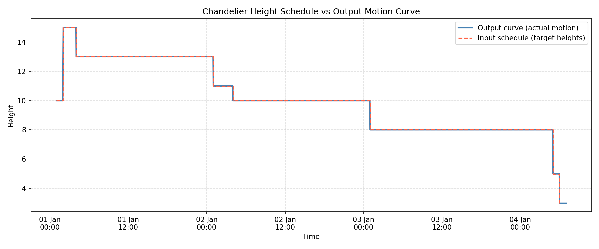

# Chandelier Height Scheduler

## What does this program do?

This program takes a simple schedule of chandelier height targets and converts them into a smooth movement curve. Instead of the chandelier snapping instantly from one height to another, it gradually transitions, the bigger the height change, the longer the transition takes.

---

## The problem it solves

Imagine you have an art installation with a chandelier that needs to be at different heights throughout the day. You give it a list like:

> "At 1am be at height 10, at 2am be at height 15, at 3am stay at 15, at 4am go to 13…"

The chandelier can't teleport — it needs to move. This program calculates **when to start moving and when to stop** so that the chandelier arrives at the right height at the right time, moving smoothly.

---

## How it works

### 1. Read the schedule (`schedule.csv`)

The input is a simple CSV file with two columns: a timestamp and a target height.

```
2025-01-01T01:00:00Z, 10
2025-01-01T02:00:00Z, 15
2025-01-01T03:00:00Z, 15
...
```

### 2. Calculate transition points

For each pair of consecutive entries, the program works out:

- **How big is the change?** (e.g. going from height 10 to 15 is a change of 5)
- **How long should the transition take?** Each unit of height change = 1 minute of movement, so a change of 5 takes 2.5 minutes each way (5 × 1 min ÷ 2 = 2.5 min)
- **When does the ramp start and end?** The transition is centred on the target time, so it starts 2.5 min before and finishes 2.5 min after

**Example:** Going from height 10 → 15 at 02:00:
- Hold at 10 until **01:57:30** (2.5 min early)
- Arrive at 15 at **02:02:30** (2.5 min late)
- Larger changes simply get a proportionally longer ramp

### 3. Remove redundant points

If three consecutive points already form a straight line, **the middle one is removed**, it adds no information. This keeps the output file clean and minimal without changing the shape of the curve at all.

### 4. Write the output (`output/output.csv`)

The result is a new CSV with the full transition curve, ready to be sent to whatever system controls the chandelier.

---

## Design decisions

**Bigger move = more time.** The chandelier takes 1 minute per unit of height change. A small change (2 units) takes 2 minutes total; a big change (10 units) takes 10 minutes. This keeps movement looking natural.

**Arrive on time, not late.** The move is split equally before and after the scheduled time. So the chandelier starts moving a little early and finishes a little late meaning it is exactly at the right height at exactly the right moment.

**Stay put at the end.** After the last entry in the schedule, the chandelier holds its final position for one hour. This prevents it drifting if nothing else tells it what to do.

**Keep the output tidy.** If several points in a row happen to form a perfectly straight line, the ones in the middle are removed as they are redundant. The curve looks identical but the file is shorter and easier to read.

---

## Project structure

```
chandelier/
├── main.py               # Entry point
├── schedule.csv          # Input: height targets and timestamps
├── output/
│   └── output.csv        # Output
├── src/
│   ├── chandelier.py     # Core logic (parse, compute, simplify, write)
│   ├── utils.py          # Shared constants (paths, timing)
│   └── plot.py           # Plots the input schedule and output curve
├── tests/
│   └── test_chandelier.py  # Automated tests covering each function
└── pyproject.toml        # Project metadata and test configuration
```

---

## Example

**Input (`schedule.csv`):**
```
2025-01-01T01:00:00Z, 10
2025-01-01T02:00:00Z, 15
2025-01-01T03:00:00Z, 15
2025-01-01T04:00:00Z, 13
```

**Output (`output/output.csv`):**
```
2025-01-01T01:00:00Z, 10
2025-01-01T01:57:30Z, 10
2025-01-01T02:02:30Z, 15
2025-01-01T03:59:00Z, 15
2025-01-01T04:01:00Z, 13
2025-01-01T05:00:00Z, 13
```

The chandelier holds at 10, ramps up to 15 over 5 minutes centred on 02:00, holds at 15, then ramps down to 13 over 2 minutes centred on 04:00, and holds.

---

## Plot



The **red dashed staircase** is the input schedule each step shows the target height being held until the next entry.

The **blue line** is the output curve, the actual motion the chandelier follows, with a short ramp up or down around each scheduled time.

The two curves sit almost on top of each other because the transition periods are very short. For example, a height change of 5 units takes only 5 minutes total,  tiny compared to the hours between schedule entries. If the height changes were much larger, or the schedule entries much closer together, the ramps would be clearly visible and the two curves would separate noticeably.

---

## Requirements

- Python 3.9 or higher
- matplotlib (installed automatically)

---

## Setup

```bash
# 1. Create a virtual environment
python -m venv .venv

# 2. Activate it
# On Windows:
.venv\Scripts\activate
# On macOS/Linux:
source .venv/bin/activate

# 3. Install the project and its dependencies
pip install -e .
```

---

## How to run it

```bash
python main.py
```

This writes the output curve to `output/output.csv` and opens the plot automatically.

To run the tests:

```bash
pytest
```
